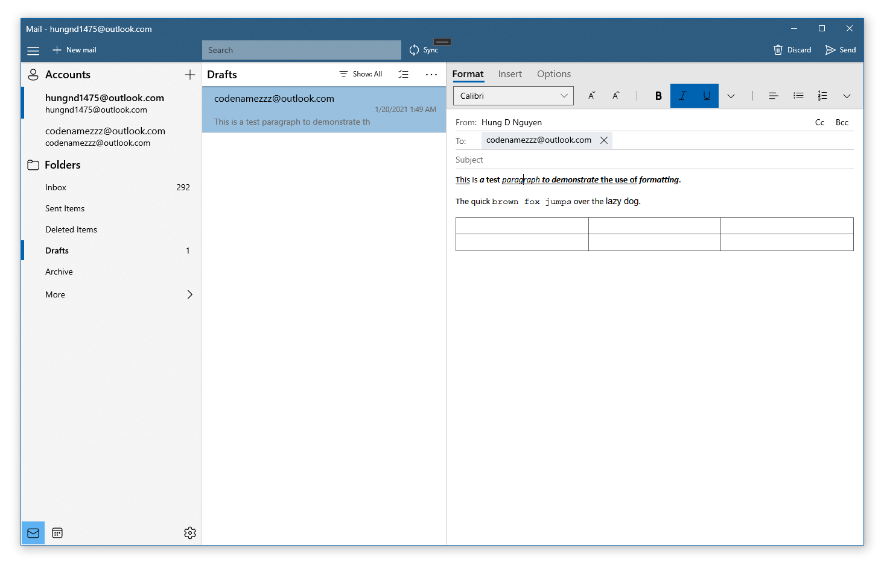

# Observatory

Observatory is an experimental project attempting to create an email client using a C# cross-platform GUI framework called Uno Platform. This project aims to support basic features of an email client and run on the three major desktop platforms - Windows, MacOS and Linux. The reason behind Observatory is that while there are countless of email desktop clients out there, a majority of them are somewhat ugly and/or limited in some ways (such as only supporting a single platform). So as a software developer who loves to experiment with new things, I decided to make my own email client with a modern design that supports a basic set features. This project is still very much a work in progress.

## Screenshots

## Features

### Functionalities

#### Mail

- [x] Retrieving mail folders
- [ ] Manipulating mail folders (renaming/adding/moving)
- [x] Viewing messages
- [x] Data virtualization in the message list to keep memory usage low.
- [ ] Searching messages
- [x] Marking messages as read/Flagging messages
- [x] Archiving/deleting/moving messages
- [x] Message batch operations
- [x] Composing messages (partially)
- [ ] Encryption support via PGP

#### Calendar

- [ ] Viewing events
- [ ] Creating/editing events

### Platforms

- [x] Windows
- [ ] MacOS
- [ ] Linux

### Email providers

- [x] Microsoft Exchange/Office 365/Outlook
- [ ] GMail
- [ ] Yahoo! Mail
- [ ] Generic POP3/IMAP

## Build Pre-requisites

To build the project on Windows, please use Visual Studio with these workloads installed:

- .NET desktop development
- Universal Windows Platform development
- Mobile development with .NET
- .NET Core cross-platform development
- Node.js development (for the HTMLEditor project)

## Contributing

I am not accepting any contribution right now as I am not very familiar with managing an open source project. However, if you have any feedback, just open an issue for that and I will happily look at it.

## License

The project is currently unlicensed, but that may change in the future when I think it is mature and useful enough to be shared with the community.
